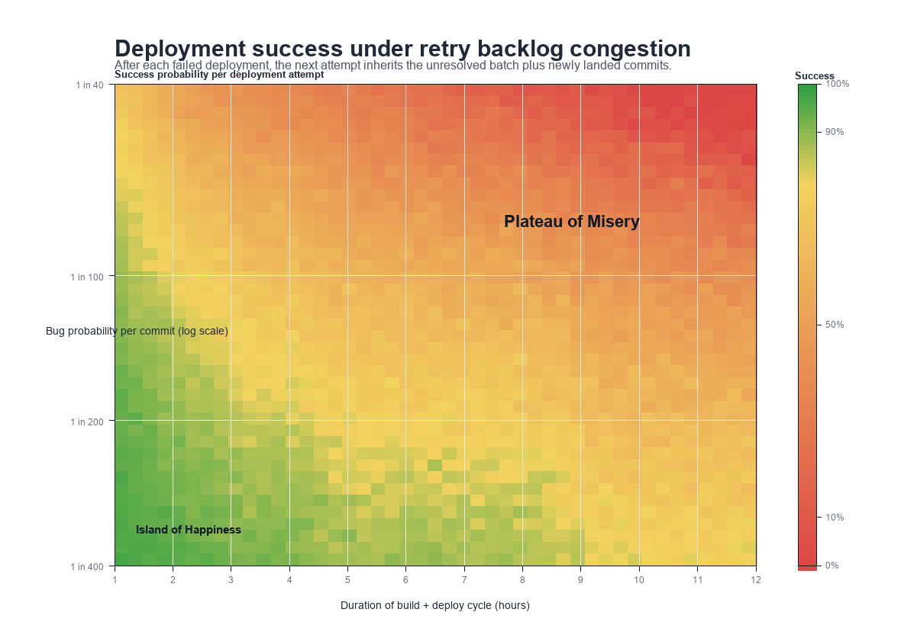

# Deployment congestion collapse simulation

This repository contains a Monte Carlo simulator for a specific failure mode in high-velocity delivery systems: when the elapsed time from commit to defect identification and removal is long relative to the commit arrival rate, failed changes can cause the unresolved deployment backlog to grow faster than it is cleared.

The purpose of the model is not to estimate any particular team's exact production risk. It is to isolate and visualize the compounding effect created by pipeline latency.

## Core mechanism

Assume the delivery pipeline takes `N` hours from commit until a defect is identified and removed from the active queue. That interval is not merely time-to-deploy; it is time-to-detection plus corrective action, culminating in a revert or equivalent removal.

If a commit contains a defect, the effect is not limited to that single commit:

1. The defective commit enters the pipeline at time `t0`.
2. The defect is detected only after approximately `N` hours, when the relevant build, deployment, and downstream validation steps complete.
3. A revert is then committed, or the defective change is otherwise removed from the queue.
4. The next deployment attempt completes roughly another `N` hours later.

Critically, that second deployment attempt is **not** a fresh start. It contains:

- the unresolved commits that were already in flight when the defect was detected, and
- the additional commits that landed while the system was waiting for detection, rollback, and the next attempt.

That accumulation is the mechanism of interest. Longer time-to-identification-and-removal increases the number of commits that can accumulate between effective validation points. Once failures occur, each retry operates on a larger unresolved batch, which increases the probability of another failure. That feedback loop is the source of the modeled congestion-collapse behavior.

An immediate implication is that one of the most effective countermeasures is to catch as many defects as possible before they ever enter the shared post-commit queue. In practice, that includes build-time checks, local validation, and development workflows that can spin up representative local stacks before commit.

## Model scope

- **Commit arrivals:** non-homogeneous Poisson process.
- **Commit volume:** mean of `100` commits per day.
- **Workday shape:** commits concentrated into a realistic `10`-hour work window with a morning ramp, lunch dip, and afternoon peak.
- **Bug probability:** independent per commit.
- **Pipeline duration:** `1` to `12` hours.
- **Bug-rate axis in the current chart:** `1 in 400` through `1 in 40` on a log scale.
- **Failure handling:** when a deployment attempt fails, one bad commit is reverted or otherwise removed, but the remaining unresolved batch persists into the next attempt together with any newly landed commits.
- **Reported metric:** success probability per deployment attempt.

This is intentionally a reduced model. It does not attempt to represent every operational mitigation a real deployment system may have, such as canary segmentation, partial isolation, selective queue draining, commit bisection, or manual intervention.

## Current results

- At **1 in 400**, success is approximately **97.6%** at `1h`, **88.5%** at `6h`, and **78.1%** at `12h`.
- At **1 in 100**, success is approximately **89.1%** at `1h`, **60.8%** at `6h`, and **42.0%** at `12h`.
- At **1 in 40**, success is approximately **71.5%** at `1h`, **25.7%** at `6h`, and **0.7%** at `12h`.

The relevant qualitative result is that the interaction between non-trivial defect rates and long validation latency is strongly nonlinear. Moderate increases in either parameter can move the system from a regime where most deployment attempts succeed to one where successful attempts become rare.

## Visualization



## Repository contents

- `simulate_deployment_congestion.py` — simulation and chart generation logic.
- `output/deployment_success_heatmap.png` — raster preview of the current chart.
- `output/deployment_success_heatmap.svg` — vector version of the chart.
- `output/deployment_success_data.csv` — simulated output for each heatmap cell.
- `output/working_day_commit_density.csv` — workday traffic profile used by the simulator.
- `output/simulation_summary.md` — short summary of the modeled assumptions.

## Reproduce

```bash
python3 simulate_deployment_congestion.py
```

The simulator itself uses only the Python standard library. The committed PNG is a generated artifact included for convenience in the README.
